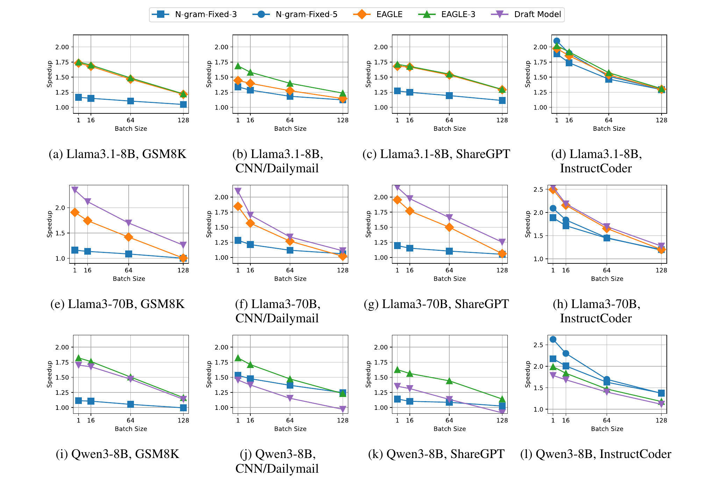
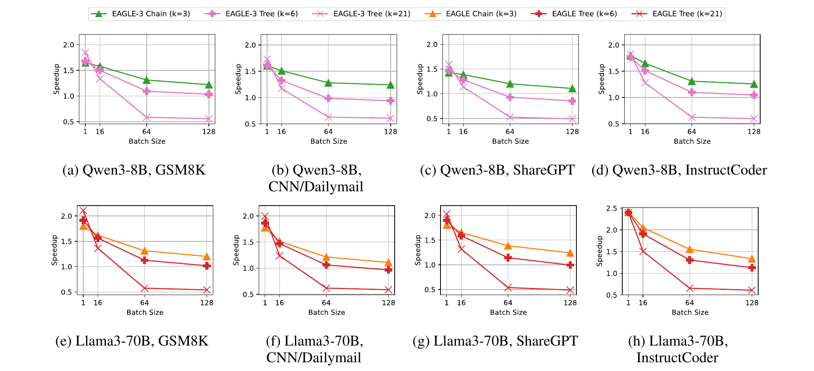
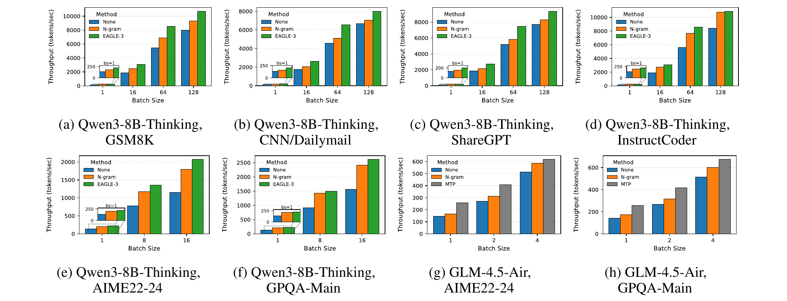
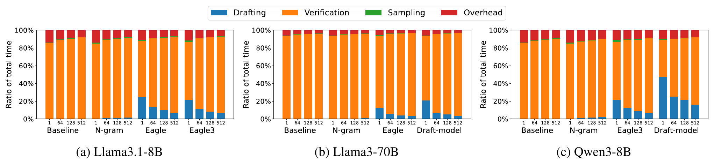
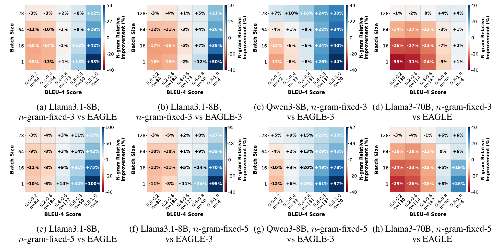
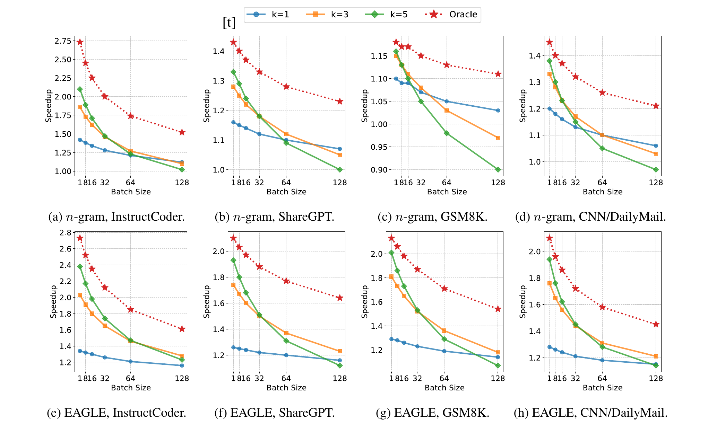
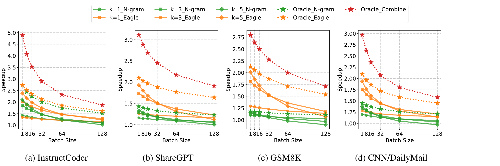

<d-contents>
  <nav class="l-text figcaption">
    <h3>Contents</h3>
    <div><a href="#tldr">TL;DR</a></div>
    <div><a href="#why-this-study">Why This Study?</a></div>
    <div><a href="#end-to-end-performance">End-to-End Performance</a></div>
    <div><a href="#where-does-the-time-go">Where Does the Time Go?</a></div>
    <div><a href="#acceptance-behavior">Acceptance Behavior</a></div>
    <div><a href="#n-gram-on-code-editing">When n-gram Wins: Code Editing</a></div>
    <div><a href="#theoretical-upper-bound">How Far From Optimal?</a></div>
    <div><a href="#combining-methods">Combining Methods</a></div>
    <div><a href="#takeaways">Key Takeaways</a></div>
    <div><a href="#links">Paper &amp; Code</a></div>
  </nav>
</d-contents>

## TL;DR
{: #tldr}

<div class="highlight-box">
<p>
Speculative decoding (SD) is widely used to speed up LLM inference, but how well does it <em>actually</em> work in production? We benchmarked <strong>five SD variants</strong>&mdash;n-gram, EAGLE, EAGLE-3, Draft-Model, and Multi-Token Prediction (MTP)&mdash;on <strong>vLLM</strong>, covering four models (Llama-3.1-8B, Llama-3-70B, Qwen3-8B, GLM-4.5-Air-106B), six diverse workloads, and batch sizes from 1 to 128 (up to 512 for profiling). All experiments use NVIDIA H100 GPUs. We measure <strong>token throughput</strong> (generated tokens per second) as our primary metric.
</p>
</div>

Here is what we found:

- **SD consistently improves throughput**, but speedups shrink as batch size grows (the system becomes compute-bound).
- **Verification dominates execution time** (42--95%), making rejected tokens expensive.
- **Acceptance behavior varies wildly**---across token positions, requests, and datasets---with each SD variant showing distinct patterns.
- **Oracle analysis reveals a large gap** between current speedups and the theoretical upper bound, pointing to untapped room for improvement.
- **Adaptively combining n-gram and EAGLE** can push the theoretical speedup to **4.9x** on code-editing workloads (InstructCoder).

## Why This Study?
{: #why-this-study}

Speculative decoding has become one of the most popular techniques for accelerating LLM inference. The idea is simple: use a fast, lightweight method to *propose* candidate tokens, then let the large target model *verify* them in parallel. When proposals are correct, you generate multiple tokens in the time it normally takes to generate one.

Despite its popularity, prior evaluations have critical shortcomings:

- They use **research prototypes**, not production-grade systems, which lack key optimizations like CUDA graph and continuous batching.
- They test at **batch size 1**---an unrealistic setting that inflates speedup numbers.
- They provide **no systematic comparison** across SD variants, leaving practitioners without guidance on which method to use.

We address all of these gaps in this study.

## End-to-End Performance
{: #end-to-end-performance}

Majority of the experiments are conducted using **vLLM v0.10.1** with all default production optimizations enabled (KV cache management, continuous batching, chunked prefill, and CUDA Graph). We run on **NVIDIA H100 80GB** GPUs---1 GPU for 8B models, 4 GPUs with tensor parallelism for 70B/106B models.

We evaluate five SD variants---**n-gram**, **EAGLE**, **EAGLE-3**, **Draft-Model**, and **MTP** with 3 draft tokens per step (i.e. k=3, and does not include the bonus token)---across six datasets (CNN/DailyMail, ShareGPT, InstructCoder, GSM8K, AIME22--24, and GPQA-Main) and four models (Llama3.1-8B-Instruct, Llama3-70B-Instruct, Qwen3-8B, GLM-4.5-Air-106B). All speedups are measured as the ratio of token throughput (generated tokens/sec) with SD vs. without SD. For complete configuration details including model pairings, batch sizes, and output length limits, see Table 5 in [our paper](https://arxiv.org/abs/2601.11580).


{: style="text-align: center;"}

<p class="figure-caption"><strong>Figure 1.</strong> End-to-end speedup across models and datasets (figures from the paper). Each subplot shows speedup (y-axis) vs. batch size (x-axis) for a given model-dataset pair. Notice how all curves trend downward as batch size increases.</p>

The key findings:

**SD always helps, but gains shrink with batch size.** At batch size 1, EAGLE achieves up to 1.96x speedup on Llama-3-70B. By batch size 128, this drops to 1.21x for Llama-3.1-8B on GSM8K. The reason: at small batches, the GPU has idle compute to spare for speculation; at large batches, the system is already compute-saturated.

**The batch size effect is amplified for larger models.** For EAGLE on ShareGPT, going from batch 1 to 32 reduces speedup by 4.3% on the 8B model but by 14.0% on the 70B model (run on 4 GPUs, which is already compute-bound at small batches).

**Draft-model methods excel on large targets; EAGLE-3 is the all-around performer.** Draft-model-based SD achieves the best results on Llama-3-70B, where the draft model's forward pass takes only ~12.5% of the target model's forward pass time---making speculation cheap. On 8B targets, this execution-time ratio rises to ~37.5%, significantly reducing the benefit. EAGLE-3 and EAGLE provide consistently strong speedups across all settings.

**n-gram is the wildcard.** It underperforms on most workloads, but *dominates* on code-editing (InstructCoder), even outperforming EAGLE and EAGLE-3 on 8B models. We investigate why in a [dedicated section below](#n-gram-on-code-editing).

### Tree vs. Chain Verification


{: style="text-align: center;"}

<p class="figure-caption"><strong>Figure 2.</strong> End-to-end performance for tree-style vs. chain-style verification on non-reasoning workloads. Evaluated in <strong>SGLang v0.5.9</strong> (not vLLM), using Qwen3-8B and Llama3-70B. We use SGLang here because the draft-tree path in the vLLM version we evaluated is not yet sufficiently optimized for a fair comparison across tree configurations. Tree depth is fixed to 3 in all runs; chain uses k=3, trees use k=6 (branching factor 2) and k=21 (branching factor 4). FlashAttention-3 is used for chain; FlashInfer for tree configurations.</p>

We compare tree-style verification (wider speculation trees) against chain-style (sequential proposals). Here, *k* denotes the total number of draft tokens verified in parallel by the target model. **Trees provide a narrow advantage at batch size 1** (e.g., 1.65x → 1.85x for EAGLE on Qwen3-8B/GSM8K going from chain k=3 to tree k=21). But by batch size 64, the k=21 tree falls *below* 1x speedup on all workloads, because verifying many ultimately-rejected branches becomes too expensive. Wider trees do increase accepted length (e.g., 2.25 → 2.92 on Qwen3-8B/GSM8K), but acceptance rate drops sharply (0.415 → 0.095), meaning most of the extra verification work is wasted. **Chain-style verification is the more robust choice.**

### Reasoning Workloads


{: style="text-align: center;"}

<p class="figure-caption"><strong>Figure 3.</strong> Absolute throughput (tokens/sec) on reasoning workloads (AIME22--24, GPQA-Main). The colored bars represent different SD methods; the gap above the gray baseline (no SD) shows the speedup. EAGLE-3 consistently leads.</p>

Reasoning workloads (short prompts, very long outputs) are increasingly prevalent. We find that **SD speedups on reasoning tasks are comparable to standard tasks**. For Qwen3-8B-Thinking, EAGLE-3 achieves 1.64--1.80x speedup on GPQA-Main and AIME22--24, while n-gram reaches 1.50--1.58x thanks to repetitive symbolic patterns in chain-of-thought reasoning.

For MTP (tested on GLM-4.5-Air-106B), speedup reaches 1.3--1.8x, but is limited because the released model includes only a single MTP head. Its position-wise acceptance rate degrades sharply across the three speculated positions (0.92 → 0.68 → 0.38 on GPQA-Main), constraining overall gains.

## Where Does the Time Go?
{: #where-does-the-time-go}

To understand why SD speedups are limited, we decompose execution time into four stages: drafting, verification, rejection sampling, and system overhead.


{: style="text-align: center;"}

<p class="figure-caption"><strong>Figure 4.</strong> Execution time breakdown across models and batch sizes. Each stacked bar shows the fraction of runtime spent on drafting, verification, sampling, and system overhead. The orange (verification) segment dominates in nearly every configuration.</p>

<div class="highlight-box">
<p><strong>Key insight:</strong> Verification by the target model dominates execution time---ranging from ~42% (draft-model on Qwen3-8B at batch 1, where drafting itself takes ~47%) to ~95% (n-gram on Llama-3-70B at batch 512, where drafting is essentially free). Rejection sampling is negligible (<1.7%) across all settings. The implication is clear: the large model's forward pass is the bottleneck, and every rejected token wastes that compute.</p>
</div>

This has a critical implication: **every rejected token wastes verification compute**. When acceptance rates are low and batch sizes are large, this wasted work becomes the primary bottleneck. This motivates a natural question: *what if we could verify only the tokens that will be accepted?* We explore this in the [upper bound analysis](#theoretical-upper-bound).

### Memory Overhead

SD's memory overhead is minimal. n-gram adds zero GPU memory. EAGLE/EAGLE-3 adds <10% to both static weights and per-token KV cache. Draft-model methods incur the most overhead---pairing Qwen3-0.6B with Qwen3-8B increases per-token memory by 1.77x. More details in [our paper](https://arxiv.org/abs/2601.11580).

## Acceptance Behavior: Not All Tokens Are Equal
{: #acceptance-behavior}

Acceptance rate is commonly reported as a single number, but this masks crucial variability. We analyze acceptance at three levels of granularity.

**Within a request:** Acceptance length varies significantly across token positions. For reasoning workloads, both n-gram and EAGLE-3 accept more tokens as generation progresses (the model accumulates repetitive patterns). But n-gram's acceptance drops near the end of generation, when the model shifts from step-by-step reasoning to writing a final answer.

**Across requests:** Even on the same dataset, per-request acceptance varies dramatically. On InstructCoder with Llama-3-70B, EAGLE produces per-step accepted spans of 2.7--7.4 tokens (5th--95th percentile), while n-gram ranges from 1.1--15.0 and draft-model from 5.6--18.3. EAGLE is consistent; n-gram is bursty.

**Across datasets:** Each SD variant has its niche. Draft-model methods achieve the longest median generation lengths. EAGLE is the most stable. n-gram has heavy-tailed distributions---most requests are short, but occasional long bursts in repetitive code yield high payoffs.

## When n-gram Wins: Code Editing
{: #n-gram-on-code-editing}

n-gram is the only **training-free** SD method we test---it simply reuses n-gram spans from the prompt or previously generated tokens. It is especially effective on code-editing tasks (InstructCoder), where outputs often repeat large spans from the input.


{: style="text-align: center;"}

<p class="figure-caption"><strong>Figure 9.</strong> Correlation between prompt--output overlap (BLEU-4) and n-gram speedup relative to EAGLE/EAGLE-3. Blue cells indicate n-gram outperforms, red cells indicate it underperforms. The transition from red to blue as you move right (higher overlap) is the key pattern.</p>

We quantify prompt--output overlap using BLEU-4 scores (a standard measure of n-gram overlap; higher means the output reuses more phrases from the prompt). The correlation is striking: once BLEU-4 exceeds ~0.6---meaning roughly 60%+ of output 4-grams already appear in the prompt---**n-gram consistently outperforms EAGLE/EAGLE-3 across all batch sizes**, achieving up to 100% higher speedup. With longer proposal lengths (k=5), the advantage grows even further.

The practical takeaway: **if your workload involves heavy prompt--output overlap (code editing, passage rewriting, template generation), n-gram is the method to use**---no training required.

## How Far From Optimal?
{: #theoretical-upper-bound}

Given that verification dominates execution time, we ask: **what is the maximum speedup SD could achieve?**

We construct an **oracle simulator** that knows the exact number of tokens that will be accepted at each step, and proposes exactly that many---eliminating all wasted verification. This provides a theoretical upper bound on SD speedup.


{: style="text-align: center;"}

<p class="figure-caption"><strong>Figure 10.</strong> Oracle (perfect prediction) vs. fixed proposal length on Llama-3.1-8B. The dashed line shows the oracle upper bound; solid lines show fixed-k configurations. The widening gap at larger batch sizes highlights how much performance is lost to wasted verification.</p>

The results reveal a **substantial gap** between current methods and the oracle. For example, on InstructCoder at batch size 1 with n-gram, the oracle achieves ~2.75x speedup while the best fixed proposal length reaches only ~2.1x. **The gap widens with batch size**: fixed-k speedups drop quickly, while oracle speedups degrade more gently, because the oracle never wastes verification on rejected tokens.

## Combining Methods: Approaching the Upper Bound
{: #combining-methods}

Different SD methods are complementary. As shown in the per-position analysis, EAGLE and n-gram each outperform the other at different token positions within the same request.


{: style="text-align: center;"}

<p class="figure-caption"><strong>Figure 12.</strong> Top row: Per-position accepted-length difference between n-gram and EAGLE on Llama-3.1-8B. Red = EAGLE accepts more tokens; blue = n-gram accepts more. The alternating red/blue pattern shows they are complementary. Bottom row: Speedup when adaptively combining methods (Oracle Combine, dashed green) vs. using each method alone.</p>

We simulate an **Oracle Combine** strategy: at each position, pick whichever method (EAGLE or n-gram) yields the longer accepted span, and propose exactly that many tokens. This represents the theoretical upper bound of an adaptive approach.

<div class="highlight-box">
<p><strong>On InstructCoder (code editing), Oracle Combine achieves up to 4.9x speedup</strong> over standard decoding---compared to ~2.2x for the best single-method oracle (EAGLE alone). On other workloads, the gains are smaller but still meaningful: ShareGPT and CNN/DailyMail show moderate headroom, while GSM8K shows little additional benefit from combining (n-gram rarely outperforms EAGLE on math tasks).</p>
</div>

This points to a **promising research direction**: developing a lightweight predictor that can adaptively select the best SD method at each token position, approaching the Oracle Combine bound without the cost of running both methods.

## Key Takeaways
{: #takeaways}

1. **SD works in production**, but expect a lower speedup in realistic batch settings, not the 3x-4x numbers often cited at batch size 1.
2. **Verification is the bottleneck**. Reducing wasted verification on rejected tokens is the most promising avenue for improvement.
3. **No single method wins everywhere.** EAGLE-3 is the best all-around choice. Draft-model methods excel when the target model is large. n-gram is optimal for code editing and high-overlap tasks.
4. **Chain > tree** for most practical batch sizes.
5. **There is substantial room for improvement.** The gap between current methods and the oracle, combined with the complementarity between methods, suggests that adaptive SD could push speedups significantly higher.

## Paper & Code
{: #links}

- **Paper:** [https://arxiv.org/abs/2601.11580](https://arxiv.org/abs/2601.11580)
- **Code (profiling & simulator):** [https://github.com/orgs/SpecDecode-Bench/repositories](https://github.com/orgs/SpecDecode-Bench/repositories)

If you find this work useful, please consider citing our paper:

```bibtex
@misc{liu2026speculativedecodingperformanceillusion,
      title={Speculative Decoding: Performance or Illusion?},
      author={Xiaoxuan Liu and Jiaxiang Yu and Jongseok Park and Ion Stoica and Alvin Cheung},
      year={2026},
      eprint={2601.11580},
      archivePrefix={arXiv},
      primaryClass={cs.CL},
      url={https://arxiv.org/abs/2601.11580},
}
```
