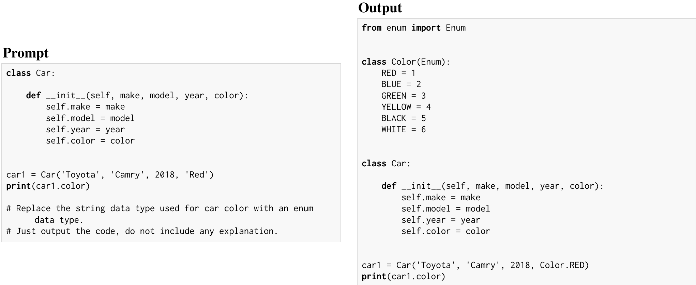

Speculative decoding has become one of the most widely discussed ways to accelerate LLM inference. The core idea is simple: use a lightweight proposer to draft tokens, then let the target model verify them in parallel. In principle, this can improve hardware utilization and generate multiple tokens per verification step.

In practice, though, the story is more nuanced.

Our paper, **“Speculative Decoding: Performance or Illusion?”**, studies speculative decoding in a production-grade serving stack rather than in a research prototype. We benchmark multiple speculative decoding methods in **vLLM** across models, workloads, and batch sizes, then dig into the two questions that matter most in deployment:

1. **When does speculative decoding actually help?**
2. **What is still limiting its performance today?**

> **TL;DR**
>
> Speculative decoding does help in real systems, but the biggest bottleneck is still verification by the target model. Acceptance behavior is highly variable across positions, requests, and datasets. Training-free **n-gram** speculation can be surprisingly strong on code-editing workloads with high token reuse. And there is still a large gap between current methods and the theoretical upper bound.

## Contents

- [Why revisit speculative decoding now?](#why-revisit-speculative-decoding-now)
- [What we evaluated](#what-we-evaluated)
- [What we found](#what-we-found)
- [Why n-gram can win on code editing](#why-n-gram-can-win-on-code-editing)
- [How far are we from the upper bound?](#how-far-are-we-from-the-upper-bound)
- [What this means in practice](#what-this-means-in-practice)
- [Code and artifacts](#code-and-artifacts)

## Why revisit speculative decoding now?

A lot of prior speculative decoding results were measured in prototype systems and often at **batch size 1**. That is useful for understanding the mechanism, but it does not fully answer the deployment question.

Real serving systems behave differently:

- They use system optimizations such as continuous batching and CUDA graphs.
- They run at a range of batch sizes, not just one.
- They expose tradeoffs that are easy to miss in simplified setups.

That is the gap we wanted to close.

## What we evaluated

We benchmark speculative decoding in **vLLM**, a production-ready inference engine, across:

- **Methods:** n-gram, EAGLE, EAGLE-3, draft-model-based methods, and MTP
- **Models:** Llama3.1-8B, Llama3-70B, Qwen3-8B, and GLM-4.5-Air
- **Workloads:** chat, summarization, code editing, math, and long-form reasoning
- **Batch sizes:** from low to high-throughput settings

One detail that matters: in practice, generated outputs can vary slightly across settings because of inference nondeterminism, even under greedy decoding. To make comparisons robust, we use **token throughput** as the main performance metric.

## What we found

### 1. Speculative decoding helps, but speedup shrinks as batch size grows

Across the main workloads, speculative decoding improves throughput over the no-SD baseline. But the gains are strongest at **small and medium batch sizes**. As batch size increases, the system becomes more compute-bound, so the extra work spent proposing and verifying rejected tokens becomes more expensive.

That is an important practical lesson: **results at batch size 1 do not tell the full deployment story**.


*Figure 1. End-to-end speedup across models and workloads. The relative benefit of speculative decoding depends strongly on model size, workload, and batch size.*

### 2. Verification, not proposing, is usually the real bottleneck

It is tempting to think the main question is which proposer is “smartest.” Our measurements suggest a different framing.

The largest share of runtime usually comes from **verification by the target model**, not from drafting:

- n-gram proposing is almost free
- EAGLE/EAGLE-3 proposing is relatively cheap
- even draft-model-based proposing is often not the dominant cost

The real cost is that the large model still has to verify drafted tokens, and that cost is especially painful when many proposals are later rejected.


*Figure 4. Verification remains the dominant runtime component across speculative decoding variants.*

### 3. Acceptance behavior is highly variable

Average acceptance rate alone hides a lot.

We find variability along at least three dimensions:

- **within a request**
- **across requests**
- **across datasets**

This matters because speculative decoding performance depends not just on whether a method is “good on average,” but on **where** and **when** it proposes tokens that the target model will actually accept.

That is one reason why a method that looks strong in one workload may be much less effective in another.

### 4. The best method depends on the workload

There is no single winner everywhere.

- On many workloads, **EAGLE-3** or **draft-model-based methods** provide the strongest gains.
- On **Llama3-70B**, draft-model-based methods can perform especially well.
- On smaller target models, the relative cost of running a draft model becomes more noticeable.
- On **code-editing workloads**, simple **n-gram** speculation can be surprisingly competitive—and sometimes better.

That last point deserves its own section.

## Why n-gram can win on code editing

n-gram speculation is attractive because it is **training-free**. Instead of learning a separate proposer, it reuses phrases that already appeared in the prompt or recent context.

That works especially well when the output strongly overlaps with the input, which is common in **code editing**.

A typical example is when the model keeps most of an existing code block and makes a localized change. In those cases, n-gram can recover long correct spans very cheaply.


*Figure 8. In code editing, the output often preserves much of the prompt structure, creating exactly the kind of local repetition that n-gram can exploit.*

We quantify this effect using prompt-output overlap. The pattern is clear:

- when overlap is low, n-gram underperforms
- as overlap rises, n-gram speedup rises
- above a sufficiently high overlap threshold, n-gram can consistently beat EAGLE or EAGLE-3

In other words: **n-gram is not just a lightweight baseline; on the right workload, it is a strong systems choice.**


*Figure 9. As prompt-output overlap increases, n-gram becomes much more competitive on InstructCoder, and can outperform EAGLE/EAGLE-3.*

## How far are we from the upper bound?

A central question in the paper is whether current speculative decoding methods are close to optimal.

They are not.

We analyze an oracle setting where the system knows, at each step, how many drafted tokens will actually be accepted. This eliminates wasted verification on tokens that would later be rejected. That gives a theoretical upper bound on achievable speedup.

The gap is substantial.

We then go one step further. Different methods are better at different token positions. In some places n-gram is better; in others, EAGLE is better. This suggests that an **adaptive hybrid** could outperform either method alone.

Under an idealized oracle combination that always picks the better method at each position, we observe **much higher achievable speedups**, reaching up to **4.9×** relative to standard decoding.

That result is not a deployable system by itself. But it does show that current speculative decoding methods are leaving meaningful performance on the table.


*Figure 12. An ideal adaptive combination of methods exposes substantial headroom beyond fixed strategies.*

## What this means in practice

For practitioners, the message is straightforward.

### Measure speculative decoding in the serving regime you actually care about

A method that looks excellent in a prototype or at batch size 1 may behave very differently in a real serving stack.

### Track verification cost, not just acceptance rate

High acceptance is valuable, but the end-to-end story depends on how much verification work you still pay for.

### Do not dismiss simple methods too quickly

Training-free approaches like n-gram can be very effective on structured, repetitive workloads such as code editing.

### There is a real opportunity for adaptive systems

The next gains may come not only from better proposers, but from systems that choose the right proposer at the right position with minimal overhead.

## Code and artifacts

We are releasing two components alongside the paper:

- a **vLLM-based profiling suite** for end-to-end throughput, time breakdown, and acceptance-rate experiments
- a **lightweight simulator** for reproducing the upper-bound and combined-proposer analyses

Repositories:

- [Profiling suite](https://github.com/SpecDecode-Bench/vllm)
- [Simulator](https://github.com/SpecDecode-Bench/simulator)

## Closing

Speculative decoding is not an illusion. It does deliver real gains.

But the real lesson from this study is that its performance is shaped by systems bottlenecks, workload structure, and acceptance dynamics far more than a single headline metric suggests.

If we want the next wave of inference speedups, we need to move beyond “does speculative decoding work?” and ask a better question:

**What combination of proposing, verification, and adaptation gets us closest to the real hardware-efficient optimum?**

---

**Paper:** [Speculative Decoding: Performance or Illusion?](https://arxiv.org/abs/2601.11580) (first released on December 2025, updated on March 2026)
**Code:** [SpecDecode-Bench](https://github.com/orgs/SpecDecode-Bench/repositories)

If you find this work useful, please consider citing our paper:

```bibtex
@article{liu2026speculative,
  title={Speculative Decoding: Performance or Illusion?},
  author={Liu, Xiaoxuan and Yu, Jiaxiang and Park, Jongseok
          and Stoica, Ion and Cheung, Alvin},
  journal={arXiv preprint arXiv:2601.11580},
  year={2026}
}
```